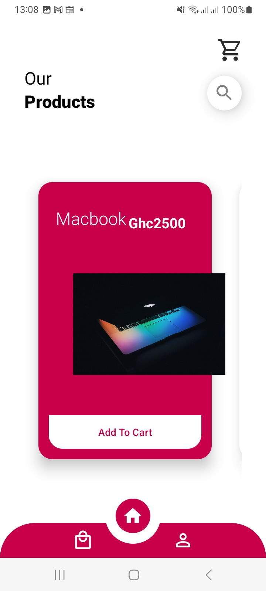
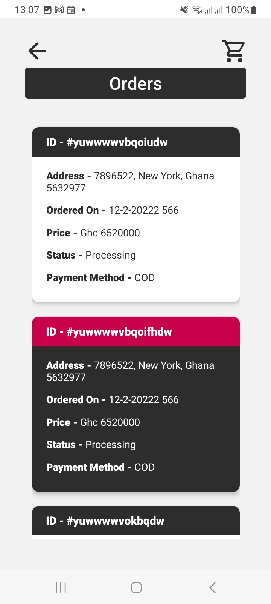
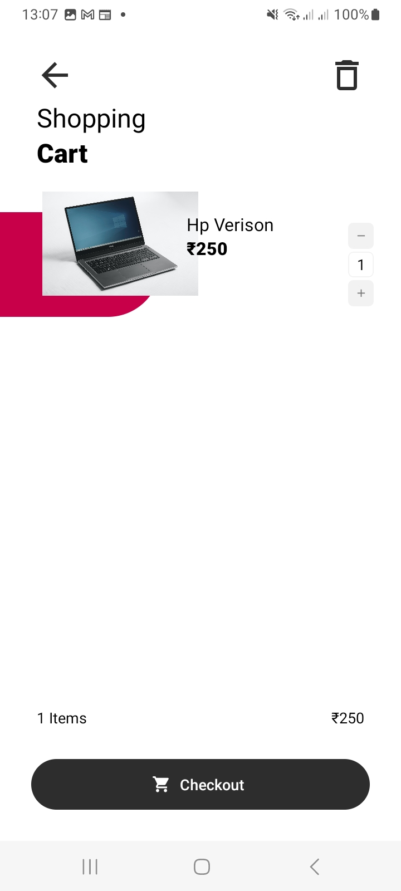
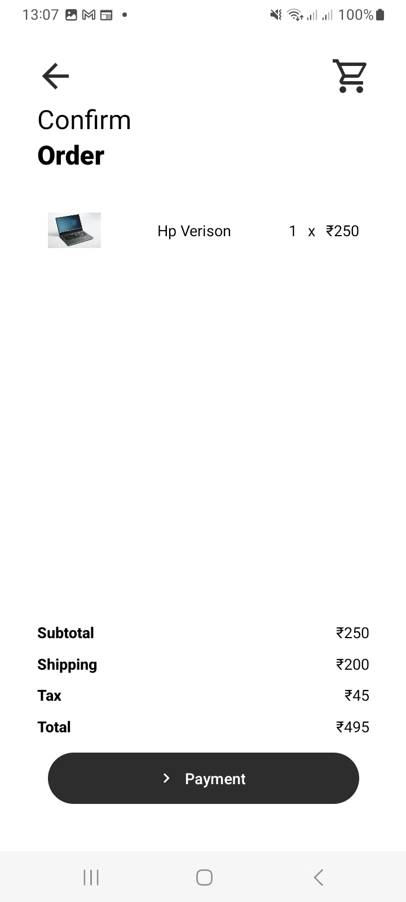
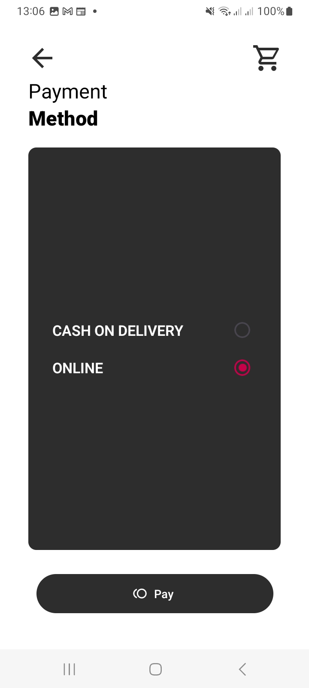
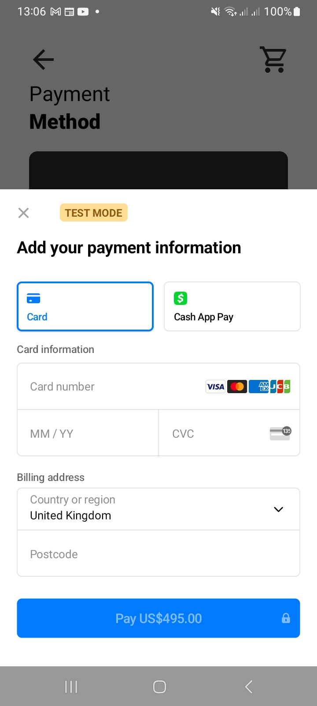

# E-Commerce-Mobile-App
React Native Image Picker for android and ios

 - [Back end of this app can be found on the following link](https://github.com/Mawuli87/E-commerce) 
- [Getting Started with Expo](https://reactnative.dev/docs/environment-setup) - an **overview** of React Native and how setup your environment.

## Created with:

- React Native Expo.
- Android version: 14
- SDK version: 34

- [Back end of this app can be found on the following link](https://github.com/Mawuli87/E-commerce)
- [Getting Started with Expo](https://reactnative.dev/docs/environment-setup) - an **overview** of React Native and how setup your environment.

## Created with:

- React Native Expo.
